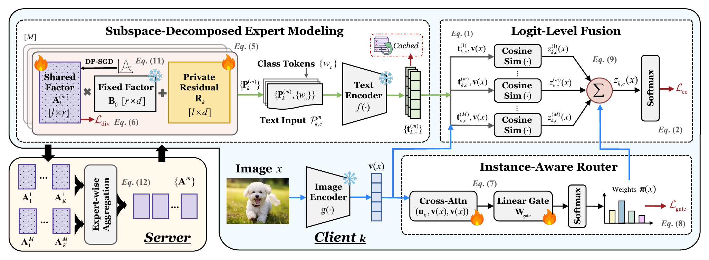

# FedSEPT

Official implementation of **Towards Privacy-Preserving Federated Prompt
Tuning under Data Heterogeneity: A Subspace-Decomposed Expert Approach**
(ACM MM 2026).



FedSEPT is a privacy-preserving federated prompt tuning framework for
heterogeneous vision-language tasks. It represents transferable knowledge with
multiple compact prompt experts while keeping client-specific residuals local.
Only low-rank shared factors are communicated and protected by DP-SGD.

---

## FedSEPT

FedSEPT contains two main components:

- **Subspace-Decomposed Expert Modeling (SEM).** Each prompt expert is
  parameterized by a compact shared factor, a fixed public basis, and a private
  client residual. The shared factors are aggregated expert-wise, while the
  residuals never leave the client.
- **Instance-Aware Expert Fusion (IEF).** An on-device router produces
  input-dependent expert weights. Expert-specific text features are cached and
  fused at the logit level for efficient inference.

The trainers explicitly call `utils/noise_backend.py` to compute clipped
per-sample gradients, inject calibrated Gaussian noise, and maintain per-client
RDP accounting. The implementation uses chunked batched vector-Jacobian
products, requiring one model forward per batch.

## High-Level Workflow

1. Each client updates its shared expert factors and private residuals.
2. Per-sample DP-SGD is applied only to the factors that will be uploaded.
3. The server performs expert-wise aggregation in the common public subspace.
4. Each client reconstructs its experts and performs instance-aware logit-level
   fusion using its private data.

---

## Supported Methods

- FedSEPT
- PromptFL
- FedPGP
- FedOTP
- FedPHA
- pFedMoAP
- DP-FPL

The corresponding command-line trainer names are `fedsept`, `promptfl`,
`fedpgp`, `fedotp`, `fedpha`, `pfedmoap`, and `dpfpl`.

---

## Requirements

The code was tested with Python 3.9, PyTorch 2.5.1, and Opacus 1.5.4. A CUDA
GPU is recommended.

```bash
conda create -n fedsept python=3.9
conda activate fedsept
pip install -r requirements.txt
```

---

## Data Preparation

Dataset files are not distributed. Empty folders under `data/` indicate the
expected layout for the eleven benchmarks:

- Pathological label skew: Food101, Caltech101, Oxford Flowers, DTD, and Oxford
  Pets
- Practical label skew: CIFAR-10 and CIFAR-100
- Domain skew: PACS, Office31, Office-Home, and DomainNet

Place each dataset in its corresponding folder or pass another parent
directory with `--root`.

---

## Example Run

Run FedSEPT on DTD:

```bash
python federated_main.py \
  --trainer fedsept \
  --dataset dtd \
  --root ./data \
  --device cuda:0 \
  --num_users 10 \
  --frac 1.0 \
  --round 50 \
  --epoch 1 \
  --train_batch_size 32 \
  --test_batch_size 128 \
  --num_shots 16 \
  --dp_mode local \
  --dp_epsilon 1.0 \
  --dp_delta 1e-5 \
  --dp_clip 1.0 \
  --dp_microbatch_size 8
```

To run a baseline, change `--trainer`, for example:

```bash
python federated_main.py \
  --trainer dpfpl \
  --dataset dtd \
  --root ./data \
  --device cuda:0
```

The default FedSEPT setup uses four experts, rank 16, four routing heads, and
`lambda_div = 10`. A zero `--dp_sigma` enables per-client automatic noise
calibration for the requested privacy budget.

---

## Main Experiments

The provided runner covers all seven methods in the three main evaluation
settings:

```bash
bash scripts/run_main_experiments.sh pathological
bash scripts/run_main_experiments.sh practical
bash scripts/run_main_experiments.sh domain
```

Set `DATA_ROOT`, `DEVICE`, or `PYTHON_BIN` to override the corresponding
defaults.

---

## Directory Layout

```text
FedSEPT/
├── assets/
├── clip/
├── configs/
├── data/
├── Dassl/
├── datasets/
├── scripts/
├── tests/
├── trainers/
├── utils/
├── federated_main.py
├── options.py
└── requirements.txt
```

- `federated_main.py` provides the federated training and evaluation entry
  point.
- `trainers/` contains FedSEPT and the six comparison methods.
- `utils/noise_backend.py` implements per-sample clipping, noise injection, and
  privacy accounting.
- `scripts/run_main_experiments.sh` launches the three main experiment groups.
- `tests/test_per_sample_dp.py` validates the per-sample DP-SGD implementation.

---

## Citation

If you find this work useful, please consider citing:

```bibtex
@inproceedings{wang2026fedsept,
  title={Towards Privacy-Preserving Federated Prompt Tuning under Data Heterogeneity: A Subspace-Decomposed Expert Approach},
  author={Wang, Yuhua and Li, Xiaodong and Guo, Yihao and Jia, Yuxiang and Zhang, Qinnan and Sun, Yifan and Zhang, Hainan and Tong, Yongxin and Zheng, Zhiming},
  booktitle={Proceedings of the 34th ACM International Conference on Multimedia},
  year={2026}
}
```

## Acknowledgements

This repository builds on
[CoOp/CoCoOp](https://github.com/KaiyangZhou/CoOp),
[Dassl.pytorch](https://github.com/KaiyangZhou/Dassl.pytorch), and
[OpenAI CLIP](https://github.com/openai/CLIP).
